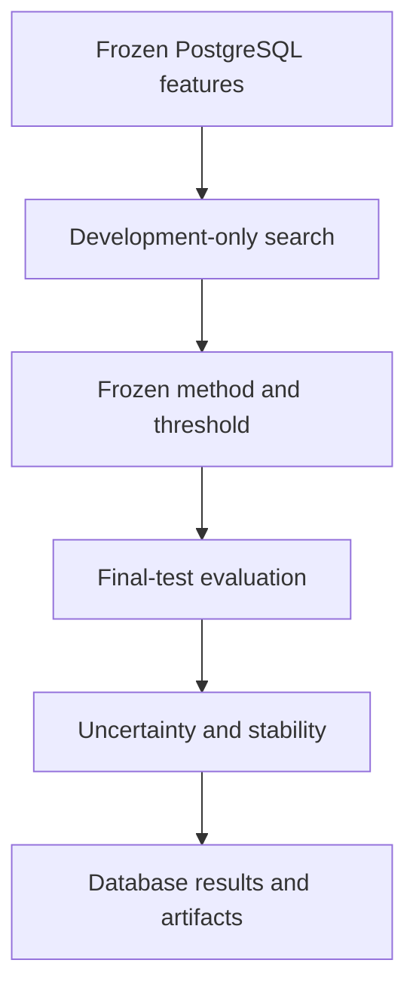

# `glob_umap` Core Computational Physics Architecture

## Introduction

This document is the implementation guide for the core numerical work that
John will author after the v0.1.0 frozen-data milestone. The existing catalogue,
crossmatch, sample, photometry, and feature pipeline supplies immutable inputs.
The new code compares identity, PCA, and UMAP representations; quantifies
classification performance and numerical uncertainty; and preserves every
result needed for review or publication.

Standard numerical and machine-learning libraries may supply established
algorithms. The project code remains responsible for data boundaries,
fold-local computation, experiment control, uncertainty propagation,
evaluation, verification, and provenance.

## Code design guideline

- Put every scientific choice, numerical tolerance, seed, search value, and
  output policy in validated YAML; Python contains no experiment-specific
  settings.
- Read frozen inputs from PostgreSQL and write results through a narrow storage
  module; numerical functions operate on explicit arrays and immutable state.
- Use `float64`, finite-value checks, stable linear algebra, explicit SQL join
  keys, and deterministic ordering unless YAML states otherwise.
- Keep functions short and single-purpose, files relatively small, and names
  descriptive without encoding experiment metadata.
- Fit scaling, representations, and classifiers only on the applicable training
  population. Never use the final test population during selection.
- Test numerical invariants and leakage boundaries, not merely successful
  execution.

## High-level architecture

The computation has four explicit stages:

1. **Tune:** Load only the development split. Reuse identical stratified folds
   for every candidate. Within each fold, fit scaling, representation, and
   classifier on the fold-training rows and predict the fold-validation rows.
2. **Freeze:** Select the candidate from out-of-fold development predictions
   using the configured metric and deterministic tie rule. Select the GC
   decision threshold at the configured development recall. Save and commit the
   resolved selection before opening the final test population.
3. **Evaluate:** Verify the frozen selection and input digests, refit the chosen
   pipeline on the full development population, then evaluate the untouched
   final test population once.
4. **Robustness:** With model choices locked, measure UMAP seed stability,
   propagate photometric measurement uncertainty, and compute paired bootstrap
   intervals for method differences.

The classifier remains three-class: globular cluster, galaxy, and star.
Candidate selection uses globular-cluster one-versus-rest average precision.
The locked operating point uses the globular-cluster probability, while the
multiclass confusion matrix uses the highest class probability.

The numerical modules live beneath `src/glob_umap/compute/`. Only `data.py` may
read analysis inputs from PostgreSQL, and only `store.py` may write numerical
results. PCA is assembled directly from centered singular-value decomposition
so its conditioning, rank, and explained variance are visible. UMAP and the
classifiers use maintained library implementations behind small project-owned
interfaces.

Photometric Monte Carlo draws operate on the six measured magnitudes and then
recompute colors. The code must not perturb 15 colors independently: colors
sharing a band have correlated errors even when the six band errors are treated
as independent.

## Sequential file and function plan

Implement and test these files in order. Do not begin final-test evaluation
until the development selection artifact has been reviewed and committed.

### 1. `pyproject.toml`

Add bounded runtime dependencies for scikit-learn and `umap-learn`. Do not add a
data-frame dependency unless a demonstrated need appears.

### 2. `config/exp/core.yaml`

Extend the frozen experiment definition with numerical dtype, SVD and rank
tolerances, deterministic selection tie handling, photometric Monte Carlo
assumptions and seeds, stability neighborhood sizes, result paths, and progress
intervals. This remains the sole source of experiment settings.

### 3. `src/glob_umap/experiment_config.py`

- `load_experiment_config(path)` — Extend the existing loader to return every
  resolved numerical and robustness setting.
- `_validate_numerics(value, path)` — Reject unsupported dtypes, solvers,
  tolerances, and nonfinite policies.
- `_validate_photometric_mc(value, path)` — Validate the measurement model,
  realization count, magnitude order, and seeds.
- `_validate_stability(value, path)` — Validate UMAP seed and neighborhood
  comparisons.

### 4. `src/glob_umap/compute/types.py`

Define frozen dataclasses for `MatrixData`, `Standardizer`, `PCAState`,
`Candidate`, `FittedPipeline`, `OOFResult`, `Selection`, and `PredictionSet`.

- `validate_matrix(data)` — Verify two-dimensional `float64` features, aligned
  object IDs and labels, finite values, unique IDs, and explicit feature order.
- `subset(data, indices)` — Return an aligned immutable subset without changing
  row order inside the selected indices.

### 5. `src/glob_umap/compute/data.py`

- `load_development(connection, config, feature_group)` — Query only the frozen
  development split in stable object and feature order.
- `load_final_test(connection, config, feature_group, selection)` — Verify the
  committed selection and input digests before querying the final test split.
- `load_magnitudes(connection, config, split)` — Load the six magnitudes and
  their reported uncertainties in the configured band order.
- `verify_alignment(left, right)` — Require identical object IDs, classes, and
  ordering across feature and magnitude matrices.

### 6. `src/glob_umap/compute/fold.py`

- `make_folds(labels, folds, seed, shuffle)` — Return stable stratified
  fold-training and fold-validation index pairs.
- `validate_folds(fold_indices, row_count)` — Prove disjoint training and
  validation rows and exactly one validation prediction per development object.

### 7. `src/glob_umap/compute/scale.py`

- `fit_standardizer(values, zero_scale_policy)` — Compute fold-training means
  and scales in `float64` and reject unusable columns under the configured
  policy.
- `transform_standardizer(values, state)` — Apply stored training statistics
  without refitting or consulting validation data.

### 8. `src/glob_umap/compute/pca.py`

- `fit_pca(values, dimensions, rank_tolerance)` — Center the fold-training
  matrix, compute its reduced SVD, and retain the requested orthonormal basis.
- `transform_pca(values, state)` — Center with the stored training mean and
  project onto the stored components.
- `pca_diagnostics(state, sample_count)` — Report singular values, explained
  variance, explained-variance ratios, numerical rank, and condition estimate.

### 9. `src/glob_umap/compute/umap.py`

- `build_umap(dimensions, parameters, seed)` — Construct a library UMAP object
  solely from the resolved candidate specification.
- `fit_umap(values, model)` — Fit the representation on fold-training rows only.
- `transform_umap(values, model)` — Transform validation or test rows with the
  already-fitted representation.

### 10. `src/glob_umap/compute/model.py`

- `build_classifier(spec, seed)` — Construct the configured random-forest or
  nearest-neighbor classifier.
- `fit_pipeline(train, candidate)` — Fit standardization, representation, and
  classifier in that order and return their immutable state.
- `predict_pipeline(data, pipeline, class_order)` — Transform new rows and
  return probability columns in the declared class order.

### 11. `src/glob_umap/compute/metric.py`

- `focal_targets(labels, focal_class)` — Convert multiclass labels to the
  declared one-versus-rest target without changing the underlying task.
- `average_precision(targets, scores)` — Calculate the configured candidate
  selection score.
- `precision_recall(targets, scores)` — Return the complete ordered
  precision-recall curve and thresholds.
- `choose_threshold(targets, scores, target_recall, tie_rule)` — Choose one
  deterministic threshold from development out-of-fold predictions only.
- `threshold_metrics(targets, scores, threshold)` — Calculate precision, recall,
  contamination, and F1 at the locked threshold.
- `confusion(labels, probabilities, class_order)` — Calculate the multiclass
  confusion matrix using the declared class order.

### 12. `src/glob_umap/compute/cv.py`

- `expand_candidates(config)` — Produce the deterministic Cartesian candidate
  list from YAML representation and classifier grids.
- `run_fold(data, fold_indices, candidate)` — Fit one fold-local pipeline and
  return validation probabilities and diagnostics.
- `collect_oof(data, folds, candidate)` — Assemble exactly one out-of-fold
  probability vector per development object.
- `evaluate_candidate(data, folds, candidate, config)` — Calculate selection
  metrics and preserve fold diagnostics for one candidate.
- `select_candidate(results, metric, tie_rule)` — Select one candidate
  deterministically without accessing final-test data.

### 13. `src/glob_umap/compute/uncert.py`

- `draw_magnitudes(values, uncertainties, rng, model)` — Draw one six-band
  realization under the explicitly configured measurement model.
- `colors_from_magnitudes(magnitudes, color_definitions)` — Recompute adjacent
  and pairwise colors from each perturbed magnitude realization.
- `run_realization(data, magnitudes, selection, seed)` — Refit and evaluate the
  locked method for one measurement realization without retuning it.
- `summarize_realizations(results, confidence_level)` — Summarize the resulting
  metric distribution without hiding failed or nonfinite realizations.

### 14. `src/glob_umap/compute/bootstrap.py`

- `stratified_indices(labels, rng)` — Resample object indices within classes
  while preserving paired method comparisons.
- `paired_differences(left, right, labels, metric, replicates, seed)` — Apply
  identical bootstrap samples to two methods and return metric differences.
- `confidence_interval(values, confidence_level, method)` — Calculate the
  configured interval and report its finite replicate count.

### 15. `src/glob_umap/compute/stability.py`

- `neighbor_indices(values, neighbors)` — Construct a deterministic nearest-
  neighbor index set for every object.
- `neighbor_overlap(left, right)` — Compare seed runs by neighborhood overlap,
  which is invariant to arbitrary UMAP rotation, reflection, and translation.
- `trustworthiness_score(source, embedded, neighbors)` — Measure preservation
  of local source-space neighborhoods.
- `summarize_seed_stability(embeddings, neighbor_sizes)` — Summarize pairwise
  stability across the YAML-defined UMAP seed ensemble.

### 16. `sql/43_prediction.sql`

Add a normalized `ml.prediction` table for per-object, per-class out-of-fold and
final-test probabilities. Its keys must identify run, object, evaluation phase,
fold, and scored class without duplicating labels already stored elsewhere.

### 17. `src/glob_umap/compute/store.py`

- `start_run(connection, config, candidate, phase)` — Create one fully resolved
  `ml.run` record before numerical work begins.
- `write_embeddings(connection, run_id, object_ids, values)` — Store coordinates
  in `ml.embed` with stable component numbering.
- `write_predictions(connection, run_id, predictions)` — Store aligned class
  probabilities in `ml.prediction`.
- `write_metrics(connection, run_id, metrics)` — Store scalar estimates,
  thresholds, intervals, counts, and scope in `ml.metric`.
- `register_artifact(connection, run_id, path, kind)` — Hash and register each
  external model, curve, matrix, or manifest.
- `finish_run(connection, run_id)` — Mark a successful run complete only after
  all required outputs pass validation.
- `fail_run(connection, run_id, error)` — Mark a failed run without presenting
  partial outputs as complete.

### 18. `src/glob_umap/compute/run.py`

- `tune(config_path, report)` — Run development-only cross-validation, select
  each method, choose its operating threshold, and write the frozen selection
  artifact.
- `evaluate(config_path, selection_path, report)` — Verify the committed
  selection, fit on all development rows, open the final test split, and record
  the one-time evaluation.
- `robust(config_path, selection_path, report)` — Run locked photometric Monte
  Carlo, UMAP seed stability, and paired bootstrap comparisons.

### 19. `src/glob_umap/cli.py`

- Add `tune`, `evaluate`, and `robust` subcommands that call the three stage
  functions. Keep argument parsing and error reporting here; keep numerical work
  in `glob_umap.compute`.

### 20. Tests

- `tests/test_scale.py` — Verify training-only statistics, zero-scale handling,
  and finite output.
- `tests/test_pca.py` — Verify orthonormal components, numerical rank, explained
  variance, and agreement with a trusted PCA calculation.
- `tests/test_fold.py` — Verify stratification, reproducibility, disjointness,
  and exactly-once validation coverage.
- `tests/test_metric.py` — Verify precision-recall ordering, threshold tie rules,
  focal-class conversion, and confusion-matrix class order.
- `tests/test_cv.py` — Use synthetic data to detect preprocessing leakage and
  misaligned out-of-fold predictions.
- `tests/test_uncert.py` — Verify zero-uncertainty identity, seeded draws, and
  exact color identities after magnitude perturbation.
- `tests/test_bootstrap.py` — Verify paired resampling, stratification, and zero
  difference for identical predictions.
- `tests/test_stability.py` — Verify invariance to rigid coordinate changes and
  sensitivity to changed neighborhoods.
- `integration_tests/test_compute.py` — Exercise tuning and result persistence
  in `gc_ml_test` while proving that tuning never queries the final test split.

The first implementation milestone ends when development-only tuning produces a
complete, reproducible selection artifact. That artifact is reviewed and
committed before any final-test command is run.
